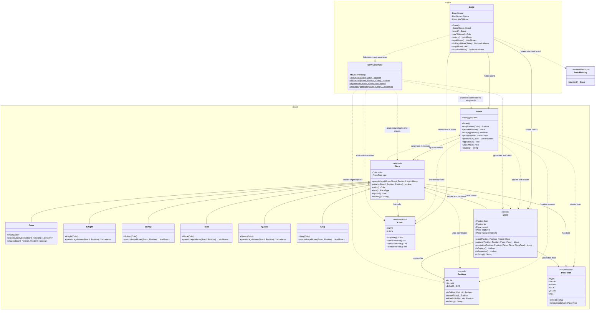
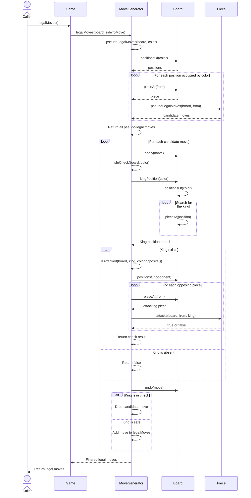

### Class diagram of engine and model

```mermaid
classDiagram
    direction TB

    namespace engine {
        class Game {
            -Board board
            -List~Move~ history
            -Color sideToMove
            +Game()
            +Game(Board, Color)
            +board() Board
            +sideToMove() Color
            +history() List~Move~
            +legalMoves() List~Move~
            +findLegalMove(String) Optional~Move~
            +play(Move) void
            +undoLastMove() Optional~Move~
        }

        class MoveGenerator {
            -MoveGenerator()
            +isInCheck(Board, Color)$ boolean
            +isAttacked(Board, Position, Color)$ boolean
            +legalMoves(Board, Color)$ List~Move~
            ~pseudoLegalMoves(Board, Color)$ List~Move~
        }
    }

    namespace model {
        class Board {
            -Piece[][] squares
            +Board()
            +kingPosition(Color) Position
            +pieceAt(Position) Piece
            +isEmpty(Position) boolean
            +place(Position, Piece) void
            +positionsOf(Color) List~Position~
            +apply(Move) void
            +undo(Move) void
            +toString() String
        }

        class Piece {
            <<abstract>>
            -Color color
            -PieceType type
            +pseudoLegalMoves(Board, Position)* List~Move~
            +attacks(Board, Position, Position) boolean
            +color() Color
            +type() PieceType
            +symbol() char
            +toString() String
        }

        class Pawn {
            +Pawn(Color)
            +pseudoLegalMoves(Board, Position) List~Move~
            +attacks(Board, Position, Position) boolean
        }

        class Knight {
            +Knight(Color)
            +pseudoLegalMoves(Board, Position) List~Move~
        }

        class Bishop {
            +Bishop(Color)
            +pseudoLegalMoves(Board, Position) List~Move~
        }

        class Rook {
            +Rook(Color)
            +pseudoLegalMoves(Board, Position) List~Move~
        }

        class Queen {
            +Queen(Color)
            +pseudoLegalMoves(Board, Position) List~Move~
        }

        class King {
            +King(Color)
            +pseudoLegalMoves(Board, Position) List~Move~
        }

        class Move {
            <<record>>
            +Position from
            +Position to
            +Piece moved
            +Piece captured
            +PieceType promotesTo
            +quiet(Position, Position, Piece)$ Move
            +capture(Position, Position, Piece, Piece)$ Move
            +promotion(Position, Position, Piece, Piece, PieceType)$ Move
            +isCapture() boolean
            +isPromotion() boolean
            +toString() String
        }

        class Position {
            <<record>>
            +int file
            +int rank
            +BOARD_SIZE$
            +isOnBoard(int, int)$ boolean
            +parse(String)$ Position
            +offsetOrNull(int, int) Position
            +toString() String
        }

        class Color {
            <<enumeration>>
            WHITE
            BLACK
            +opposite() Color
            +pawnDirection() int
            +pawnStartRank() int
            +promotionRank() int
        }

        class PieceType {
            <<enumeration>>
            PAWN
            KNIGHT
            BISHOP
            ROOK
            QUEEN
            KING
            +symbol() char
            +fromSymbol(char)$ PieceType
        }
    }

    class BoardFactory {
        <<external factory>>
        +standard() Board$
    }

    Piece <|-- Pawn
    Piece <|-- Knight
    Piece <|-- Bishop
    Piece <|-- Rook
    Piece <|-- Queen
    Piece <|-- King

    Game --> Board : holds board
    Game --> "0..*" Move : stores history
    Game --> Color : stores side to move
    Game ..> MoveGenerator : delegates move generation
    Game ..> BoardFactory : creates standard board

    Board --> "0..64" Piece : squares contain
    Board ..> Position : locates squares
    Board ..> Move : applies and undoes
    Board ..> Color : searches by color
    Board ..> PieceType : locates king

    Piece --> Color : has color
    Piece --> PieceType : has type
    Piece ..> Board : generates moves on
    Piece ..> Position : uses coordinates
    Piece ..> Move : returns moves

    Move --> Position : from and to
    Move --> Piece : moved and captured
    Move --> PieceType : promotion type

    MoveGenerator ..> Board : examines and modifies temporarily
    MoveGenerator ..> Piece : asks about attacks and moves
    MoveGenerator ..> Position : checks target squares
    MoveGenerator ..> Color : evaluates each side
    MoveGenerator ..> Move : generates and filters
```
### Sequence diagram for game.legalMoves()

```mermaid
sequenceDiagram
    actor Caller
    participant Game
    participant MG as MoveGenerator
    participant Board
    participant Piece

    Caller->>Game: legalMoves()
    Game->>MG: legalMoves(board, sideToMove)

    MG->>MG: pseudoLegalMoves(board, color)
    MG->>Board: positionsOf(color)
    Board-->>MG: positions

    loop For each position occupied by color
        MG->>Board: pieceAt(from)
        Board-->>MG: piece
        MG->>Piece: pseudoLegalMoves(board, from)
        Piece-->>MG: candidate moves
    end

    MG-->>MG: Return all pseudo-legal moves

    loop For each candidate move
        MG->>Board: apply(move)
        MG->>MG: isInCheck(board, color)

        MG->>Board: kingPosition(color)
        Board->>Board: positionsOf(color)

        loop Search for the king
            Board->>Board: pieceAt(position)
        end

        Board-->>MG: King position or null

        alt King exists
            MG->>MG: isAttacked(board, king, color.opposite())
            MG->>Board: positionsOf(opponent)

            loop For each opposing piece
                MG->>Board: pieceAt(from)
                Board-->>MG: attacking piece
                MG->>Piece: attacks(board, from, king)
                Piece-->>MG: true or false
            end

            MG-->>MG: Return check result
        else King is absent
            MG-->>MG: Return false
        end

        MG->>Board: undo(move)

        alt King is in check
            MG->>MG: Drop candidate move
        else King is safe
            MG->>MG: Add move to legalMoves
        end
    end

    MG-->>Game: Filtered legal moves
    Game-->>Caller: Return legal moves
```